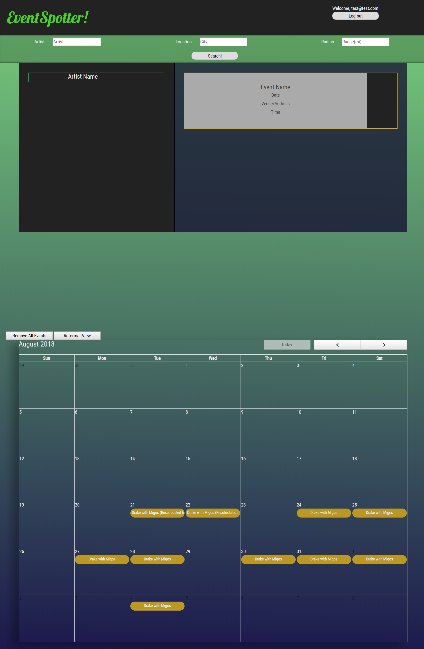
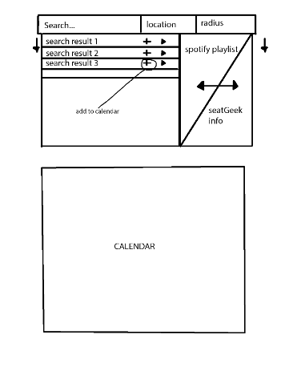

# EventSpotter

Search a city to see what concerts are being held and which artists are in town. Or search for your favorite artist to see where they will be perforing next.



## Getting Started

You can find the site here:

[EventSpotter](https://brianq0.github.io/SpotifyEvents/)

### Prerequisites

You can access this site from any internet browser including: 


[Google Chrome](https://www.google.com/chrome/)

[Firefox](https://www.mozilla.org/en-US/firefox/new/)


## Deployment

The site is deployed through [GitHub Pages](https://pages.github.com/) and their wonderful free hosting.

## Built With

* HTML
* CSS (Grid)
* [Bootstrap](https://getbootstrap.com/)
* JavaScript / [jQuery](https://jquery.com/)
* [Firebase](https://firebase.google.com/)
* [FullCalendar](https://fullcalendar.io/)
* [Moment.js](https://momentjs.com/)

## APIs

* [SeatGeek API](https://platform.seatgeek.com/)

    The SeatGeek API allows us to search for events based on different parameters like event name, performer name, type of event, and location of event.

* [Google Places](https://developers.google.com/places/web-service/intro)

    We only used the city, state search functionality to limit our user inputs into something the SeatGeek API can accept, but the Google Places library has a lot more functionality including searching for specifc buildings, tourist attractions, and general addresses.

* [Spotify API](https://developer.spotify.com/documentation/web-api/)

    We used the Spotify API to search for songs based on the user's input. This was to allow the user to preview the music before they buy a ticket to the concert.

## Our Process
**Testing APIs:** The first step we took was to look through a list of APIs and see which ones we could realisticly use. What I mean by realisticly is that the key is easily obtained, and that we can return a useable JSON object. In this first step, we through out many ideas like using AirBnB API for housing and using Ticket Master for tickets because their APIs were not easily accessible.

**Brainstorming:** After testing APIs, we now knew which APIs we could use and we started jotting down idea after idea of what we thought was possible. After going through all the wonderful and not so wonderful ideas, we settled with this event search/calendar website.

**Designing:** We knew we needed a search function, and we needed an area to displace search results. So we created a search bar on top and it would make sense to put search results below that. We also knew we needed a calendar. Some initial thoughts we had were to put the calendar on another page, but then we thought that it would be easier for the user to just scroll down to see changes on the calendar. We also knew we wanted to incorporate spotify into the website, so we made the events swap out with the music player. Next we thought there should be buttons, but their positioning was subject to change. Combining all of what I just typed, we have the result in this sketch. The final webpage looks really similar to our initial design.



**Coding:** We had a list of what we wanted the site to be able to do. Search for events, play music, and add events to a calendar. We all split up our tasks and coded away. After a coding session, we all gathered on Zoom to discuss what we did and what else needed to be done.

## Tasks
### [Bryan](https://github.com/liangbryan2)

I was in charge of the Firebase database and the SeetGee API. For Firebase, I create the functionality to log in and create a new user. This uses the Firebase.auth() functions and the user inputs. All the data needed for the calendar is stored on the Firebase database so that each unique user would have their calendar populated on login.
```JS
$("#logIn").on("click", function (e) {

        e.preventDefault();
        firebase.auth().setPersistence(firebase.auth.Auth.Persistence.LOCAL).then(function () {
            var email = $("#emailText").val().trim();
            var password = $("#passwordText").val().trim();
            auth.signInWithEmailAndPassword(email, password).catch(function (error) {
                console.log(error.code);
            })
        })
    });

    $("#signUp").on("click", function (e) {
        e.preventDefault();
        firebase.auth().setPersistence(firebase.auth.Auth.Persistence.LOCAL).then(function () {
            var email = $("#emailText").val().trim();
            var password = $("#passwordText").val().trim();
            auth.createUserWithEmailAndPassword(email, password).catch(function (error) {
                console.log(error.code);
            })
        })
    });
```
For SeetGeek, I called multiple ajax calls to gather information about the artiststs and events. In this code snippet, I had to use different ajax calls based on the user inputs because the SeatGeek API only allowed certain parameters for different searches. For example, you can search for events in a specifc area, but you cannot search for an artist in a specific area.
```js
function getEvents(id) {
    if (zipcode && range) {
        $.ajax({
            url: cors + baseUrl + event + "?performers.id=" + id + geoip + zipcode + "&range=" + range + "mi" + clientId,
            method: "GET"
        }).then(function (result) {
            console.log(result);
            $("#eventList").empty();
            events = result.events;
            if (events.length === 0) {
                displayError();
            } else {
                $("#eventList").show();
                fillEvents(events);
            }
        });
    } else if (zipcode) {
        $.ajax({
            url: cors + baseUrl + event + "?performers.id=" + id + geoip + zipcode + clientId,
            method: "GET"
        }).then(function (result) {
            console.log(result);
            $("#eventList").empty();
            events = result.events;
            if (events.length === 0) {
                displayError();
            } else {
                $("#eventList").show();
                fillEvents(events);
            }
        })
    } else {
        $.ajax({
            url: cors + baseUrl + event + "?performers.id=" + id + clientId,
            method: "GET"
        }).then(function (result) {
            console.log("Performer search only: " + result);
            $("#eventList").empty();
            events = result.events;
            if (events.length === 0) {
                displayError();
            } else {
                $("#eventList").show();
                fillEvents(events);
            }
        })
    }
}
```
I also worked on storing the data from these JSON objects into a easily accessible format for other members on the team. For example, the calendar team needed an array of objects, so in my functions, I stored the data in that array of objects format.

### [Brian](https://github.com/brianq0)

Type what you did here


### [Muhammad](https://github.com/mawais54013)

Type what you did here


### [Zia](https://github.com/ztabbasi)

Type what you did here


## Authors

* **Brian Qian** - https://github.com/brianq0
* **Bryan Liang** - https://github.com/liangbryan2
* **Muhammad Awais** - https://github.com/mawais54013
* **Zia Abassi** - https://github.com/ztabbasi

## License

This project is licensed under the MIT License - see the [LICENSE.md](LICENSE.md) file for details

## Acknowledgments

* UCB Extension Coding Bootcamp 
